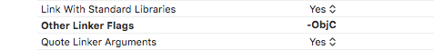
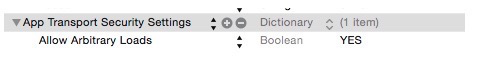

<center><font size=11>海游SDK</font></center>

##一、说明
###  1、SDK说明  

​        HaiyouSDK V1.0.0 ： 包含支付和登陆功能

### 2 、SDK结构

​         haiyousdk.framwork 和 haiyouSDK.bundle SDK的核心框架和资源。

##二、接入步骤
### 1、导入SDK

​         将SDK中的文件拖放导入工程， 选择正确的target.

### 2、开发环境配置

​    1 在Build Settings—>Linking ->Other Linking Flags中配置 -ObjC

​      如图：

​    2 在info.plish中添加网络请求权限

​       如图: 

## 三、接口说明

###  3.0、初始化

####        3.0.1、导入头文件

```objective-c
import <HaiYouPaySDK/HaiYouPaySDK.h>
```

####        3.0.2、初始化

​       函数： -(void)setConfigWithAPPID:(NSString *)appID WithHaiYouKey:(NSString *)haiyouKey;

​       功能： 根据 appid 和haiyouKey  初始化SDK。

​       参数 ： appid  海游平台分配的产品id。

​                    haiyoukey  海游平台分配的秘钥。

​       返回值 : 无

​       示例：

```objective-c
 [[HaiYouConfig shareConfig]setConfigWithAPPID:@"海游appid" 
                                     WithHaiYouKey:@"海游key"];
```

###    3.1 、账号系统

​              支持账号登陆 和 游客登陆两种登陆方式

####       3.1.1、登陆回调

​     添加回调通知

```objective-c
  [[NSNotificationCenter defaultCenter] addObserver:self selector:@selector(loginResult:) name:HaiYouSDKNotiLogin object:nil];
```

​    实现回调方法

```objective-c
- (void)loginResult:(NSNotification *)notification {
    NSDictionary *dic= notification.userInfo;
    NSString *state=[dic objectForKey:@"state"];
    NSString *type=[dic objectForKey:@"type"];
    // type 区分： 登陆信息  获取登陆中的用户信息
    if([type isEqualToString:@"userinfo"]){
     //    "保存的用户信息"  
    }else if([type isEqualToString:@"login"]){
    //     "登录信息"  
    }
    // state 区分状态 成功  失败
    if([state isEqualToString:HaiYouSDKStateSuccess]){
        HaiYouUser *user= [dic objectForKey:@"data"];
        // 登陆成功
    }else{
        NSError *error=   [dic objectForKey:@"error"];
        // 登陆失败
    }
}
```


####       3.1.2、 登陆

​           函数： -(**void**)LoginWithType:(LoginType)loginType;;

​           功能： 调用登陆界面进行登陆。

​           参数 ： LoginType  泛型 。

​                          1） Login_Type_DefaultDialog               // 打开默认登陆页面*

​                          2） Login_Type_Guest                           *// 游客登录*                                        

​           返回值 : 无

​            示例：

```objective-c
    [[HaiYouLoginHelper sharedSingleton]LoginWithType:Login_Type_DefaultDialog];
```

####  

####    3.1.3、获取登陆的用户信息

​          函数： -(**void**)lastUserInfo;

​           功能： 获取正在登陆用户的个人信息。

​           参数 ：无

​           返回值 : 无

​            示例：

```objective-c
    [[HaiYouLoginHelper sharedSingleton]lastUserInfo];    
```

3.1.4 退出登陆

```objective-c
[[HaiYouLoginHelper sharedSingleton]logout];    
```

 

###   3.2、 支付系统

​        支持 ios 应用内支付

####       3.2.1、支付回调

```objective-c
// 支付回调    
    [[NSNotificationCenter defaultCenter] addObserver:self selector:@selector(payResult:) name:HaiYouSDKNotiPay object:nil];
// 查询订单回调   
    [[NSNotificationCenter defaultCenter] addObserver:self selector:@selector(checkOrderResult:) name:HaiYouSDKNotiPayCheckOrder object:nil];
```

​         实现回调接口

```objective-c
- (void)payResult:(NSNotification *)notification {
    //do something when received notification
    //notification.name is @"NOTIFICATION_NAME"
    NSDictionary *dic= notification.userInfo;
    NSString *state=   [dic objectForKey:@"state"];
    PayModel *paymode=[dic objectForKey:@"data"];
    NSError *error=   [dic objectForKey:@"error"];
  if([state isEqualToString:HaiYouSDKStateSuccess]){
      //支付成功  
    }else if ([state isEqualToString:HaiYouSDKStateError]){
      // 支付失败
    }else{
      // 状态未知  等同支付失败
    }    
}

```


####       3.2.2、调用支付

​           函数：-(**void**)startPayWithProductID:(NSString *)productID WithPrice:(NSString *)price WithCurrency:(NSString *)currency WithExtraString:(NSString *)extraString;

​           功能： 调用支付行为。

​           参数 ：productID                   商品ID( 和apple 后台一致 )

​                       price                           商品价格

​                      currency                      商品单位

​                      extraString                  额外参数 (支付成功后 原样返回)

​           示例：

```objective-c
[[HaiYouPayHelper sharedSingleton]startPayWithProductID:@"商品id" 
                                           WithPrice:@"商品价格" 
                                           WithCurrency:@"货币单位"
                                           WithExtraString:@"额外参数"];

```

####     

####   3.2.3、查询订单

​           函数：-(**void**)checkOrderWithID:(NSString *)orderID;;

​           功能： 根据订单查询支付信息。

​           参数 ：orderID                   商品交易ID

​           示例：

```objective-c
    [[HaiYouPayHelper sharedSingleton]checkOrderWithID:@"商品订单"];
```


###  3.3 、回调信息说明

​    3.3.1 登陆回调信息

| 名称  | 类型       | 备注                                                         |
| ----- | ---------- | ------------------------------------------------------------ |
| state | NSString   | 成功 和 失败两种状态                                         |
| type  | NSString   | 登录信息 和 登陆的用户信息 两种状态 ，用 login 和 userinfo 表示 |
| data  | HaiYouUser | 用户信息 ：成功时返回  失败时为nil   具体参数在 HaiYouUser.h文件中查看 |
| error | NSError    | 错误信息  使用error.localizedDescription方法查看具体信息     |

​      

​    3.3.2 支付信息回调

| 名称  | 类型     | 备注                                                     |
| ----- | -------- | -------------------------------------------------------- |
| state | NSString | 成功 和 失败两种状态 ****                                |
| data  | PayModel | 自定义参数 ：详细信息查看PayModel.h                      |
| error | NSError  | 错误信息  使用error.localizedDescription方法查看具体信息 |

​    3.3.3 订单号查询信息回调

​      同 3.3.2

   

​     

 
